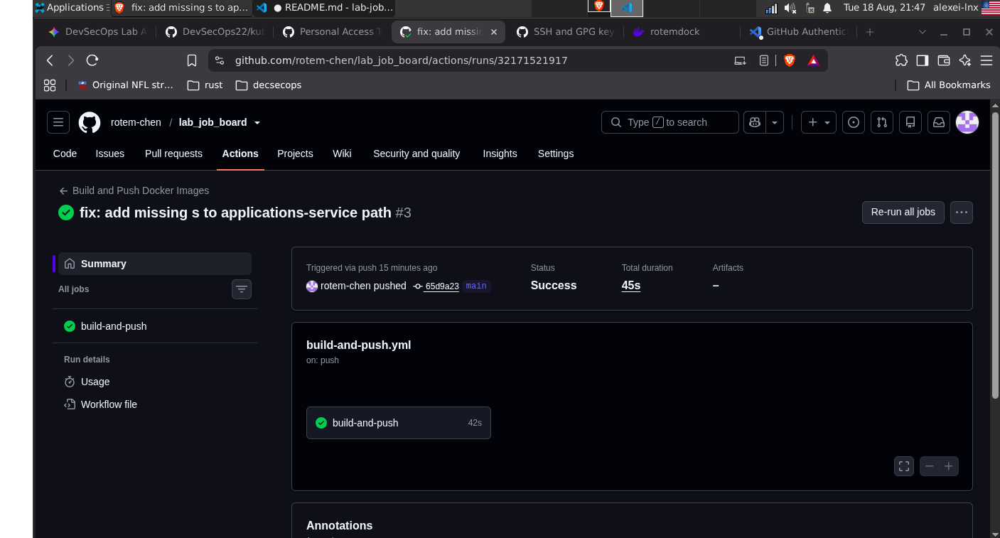

### 1.1 Trivy Scan Results

```text
- Applications Service: 
    Total: 28 (UNKNOWN: 0, LOW: 2, MEDIUM: 8, HIGH: 17, CRITICAL: 1)
- Jobs Service:         
    Total: 178 (UNKNOWN: 33, LOW: 66, MEDIUM: 56, HIGH: 19, CRITICAL: 4)
    Total: 13 (UNKNOWN: 0, LOW: 2, MEDIUM: 8, HIGH: 3, CRITICAL: 0)
- Frontend Service: 0 vulnerabilities (Clean)


### 1.1 – Run a vulnerability scan on all images

**1. How many CRITICAL CVEs did you find in total across all images?**
Across all images, I found a total of **5 CRITICAL CVEs**. 
Breaking it down: 4 critical vulnerabilities were detected in the `jobs-service` image (specifically within the OS layer), and 1 critical vulnerability was found in the `applications-service` image (within the Node.js packages). The `frontend` service image was entirely clean.

**2. Which image has the most vulnerabilities?**
The image with the highest number of vulnerabilities is **`lab-job-board-jobs-service`**. 
It contains a total of **191 vulnerabilities** (178 vulnerabilities originating from the Debian OS base layer, and 13 originating from the Python library dependencies).

**3. Pick one CRITICAL CVE and explain:**
I selected **CVE-2026-59873** for this analysis.
* **(a) What it is:** This is a **Denial of Service (DoS)** vulnerability. It occurs when an application attempts to parse a maliciously crafted, highly compressed archive (commonly known as a "Gzip Bomb"). When the server extracts the file, it leads to extreme memory and CPU exhaustion, ultimately causing the service to crash.
* **(b) Which package it affects:** This vulnerability affects the **`tar`** package in Node.js. In our scan, the vulnerable version `6.2.1` was found installed in the `applications-service` container.
* **(c) What the fix/mitigation is:** The mitigation requires a version upgrade. The development team must update the `tar` library dependency in the `package.json` file to the patched secure version, which is **`7.5.19`** (or newer).

### 1.2 – Harden the Dockerfiles

I successfully analyzed and hardened the Dockerfiles for both **jobs-service** and **applications-service**. Here are the improvements I applied:

1. **Non-Root User:** I ensured that both images drop privileges and run as `appuser`.
2. **Digest Pinning:** I pinned the `FROM` base images to their exact SHA256 digests (e.g., `node:20-alpine@sha256:...` and `python:3.12-slim@sha256:...`) to mitigate supply chain risks.
3. **Layer Count Reduction:** I chained the package manager commands (`apt-get update && apt-get upgrade -y && rm -rf ...`) into a single `RUN` instruction to prevent creating unnecessary intermediate layers.
4. **Enforcing Least Privilege & Reducing Size:** I removed the `RUN chown -R appuser:appgroup /app` instructions. By leaving the file ownership to `root` and only switching to `USER appuser` at runtime, the application runs in a secure **Read-Only** mode. Furthermore, this prevented Docker from duplicating the source files and `node_modules` into a new layer, significantly reducing the final image size.
5. **Validation:** I verified that valid `.dockerignore` files are present to keep the build context clean, and that proper `HEALTHCHECK` instructions are correctly configured for both services.

#### Image Size Reduction (Before vs. After)

By eliminating the redundant `chown` layer and chaining commands, I achieved the following results:

* **Applications Service:**
  * Before: 223MB
  * After:  216MB (reduced by 7MB by avoiding `node_modules` layer duplication).
* **Jobs Service:**
  * Before & After sizes remained virtually identical due to the extremely small footprint of the Python source code, but the overall layer count was optimized and security was greatly improved.

jobs-service
    jobs-service image sizes before: lab-job-board-jobs-service   latest      274MB
    jobs-service image sizes after: lab-job-board-jobs-service          latest      274MB
    In jobs-service, the image size remained approximately the same because the Python source code is very lightweight. However, the layer count was successfully reduced by chaining the apt-get commands with && and removing the redundant chown layer."

applications-service
    applications-service image sizes before: lab-job-board-applications-service   latest      223MB
    applications-service image sizes after:
     lab-job-board-applications-service   latest      216MB 

frontend 
    frontend image sizes before: lab-job-board-frontend               latest        98MB
    frontend image sizes after: lab-job-board-frontend               latest        98MB


### 2.2 – Environment variable isolation

1. I created the `.env` file and set a strong, complex password for `POSTGRES_PASSWORD`.
2. I validated that temporarily removing the `.env` file breaks the application stack (due to the credential mismatch between the Docker Compose default fallbacks and the initialized database volume). Restoring the `.env` file brought the stack back to a healthy state.
3. The `.env` file is properly listed in `.gitignore` to prevent accidental commits.

**Why committing `.env` to Git is a critical security risk:**
The `.env` file typically contains highly sensitive secrets such as database passwords, API keys, and cloud provider credentials. If committed to a version control system (like GitHub), these secrets become instantly accessible to anyone with repository access. If the repository is public, automated bots constantly scrape GitHub for exposed keys, leading to immediate account takeovers, data breaches, and financial damage.

**Tools used to prevent secrets from being committed:**
To mitigate this risk, security teams use automated secret scanning tools, such as:
* **git-secrets** (Prevents commits containing secrets).
* **TruffleHog** (Scans repository history and branches for leaked credentials).
* **GitHub Secret Scanning** (Native GitHub feature that alerts on or blocks pushed secrets).


### 2.3 – Service restart policy and dependency ordering

ASCII Art Dependency Graph
postgres
   │
   ├──► jobs-service ─────────────┐
   │        │                     │
   │        ▼                     │
   │     frontend ──────┐         │
   │        ▲           │         ▼
   │        │           ├─────► nginx
   ├──► applications-service ─────┘

condition: service_healthy vs condition: service_started
service_started: This only checks if the container process has begun executing. It does not mean the application inside is actually ready to receive traffic. If an app tries to connect to a DB that is only "started", the connection might fail because the DB engine is still booting up.

service_healthy: This forces Docker to wait until the dependency's HEALTHCHECK command succeeds. It guarantees that the service is fully operational, initialized, and ready to accept connections before starting the dependent containers.

What happens if postgres crashes after other services are running?
I run docker compose stop postgres. When the database drops, Docker Compose does not automatically stop the dependent services (jobs-service and applications-service). The dependent containers remain in a "running" state, but the applications inside them lose their database connection and begin throwing internal server errors or connection timeouts.

docker compose ps
WARN[0000] The "TRo" variable is not set. Defaulting to a blank string. 
WARN[0000] The "TRo" variable is not set. Defaulting to a blank string. 
WARN[0000] The "TRo" variable is not set. Defaulting to a blank string. 
WARN[0000] The "TRo" variable is not set. Defaulting to a blank string. 
NAME                   IMAGE                                COMMAND                  SERVICE                CREATED          STATUS                      PORTS
applications-service   lab-job-board-applications-service   "docker-entrypoint.s…"   applications-service   20 minutes ago   Up 20 minutes (healthy)     3001/tcp
jobboard-frontend      lab-job-board-frontend               "/docker-entrypoint.…"   frontend               20 minutes ago   Up 20 minutes (unhealthy)   80/tcp
jobs-service           lab-job-board-jobs-service           "uvicorn app.main:ap…"   jobs-service           20 minutes ago   Up 20 minutes (healthy)     8000/tcp
nginx-proxy            lab-job-board-nginx                  "/docker-entrypoint.…"   nginx                  20 minutes ago   Up 20 minutes (unhealthy)   0.0.0.0:80->80/tcp, [::]:80->80/tcp

#### 3.1 – Verify persistence across restarts

I successfully verified that data persists across container restarts by creating a job, stopping the stack, starting it again, and confirming the job was still retrievable via the API.

**Difference between `down`, `down -v`, and `stop`:**
* **`docker compose stop`**: Gracefully stops running containers without removing them or their networks. The container state remains intact.
    **Use case:** Temporarily pausing execution to save CPU/RAM, intending to resume exactly where you left off.
* **`docker compose down`**: Stops and completely removes containers and default networks, but leaves Volumes fully intact.
     **Use case:** Cleaning up the workspace/Docker engine after a work session, while keeping the persistent data ready for the next run.
* **`docker compose down -v`**: Stops and removes containers, networks, AND named volumes. This is a destructive action. 
    **Use case:** Total factory reset. Used when you want to wipe the database and start from a completely clean slate.


#### 3.2 – Volume inspection

1. Where on the host machine is the data actually stored?
 "Mountpoint": "/home/docker/volumes/jobboard-postgres-data/_data"

2.Named Volume vs. Bind Mount:
    Named Volume: A storage area entirely managed by Docker within its internal directory structure (in our lab environment, located at "/home/docker/volumes..."). Docker abstracts away the host OS permissions.

    Bind Mount: Maps a specific, absolute path from the host machine directly into the container (e.g., mapping a local `./data` folder on your Desktop to `/app/data` inside the container).

3.When to prefer each in production:

    Named Volume: Use this in production for databases (like PostgreSQL). Docker manages the storage completely, which prevents file-permission errors and makes it much safer and easier to back up.
    Bind Mount: Use this in production ONLY for injecting configuration files (like `nginx.conf`). Otherwise, it is mostly used in local development so developers can edit code and see changes immediately without rebuilding the container.


<!-- When to prefer each in production:** 
* In **production**, **Named Volumes** are heavily preferred. They are isolated from host file-system permission issues, easier to back up using Docker CLI tools, and don't depend on the underlying host directory structure, making the containers highly portable.
* **Bind Mounts** are generally reserved for local **development** environments (e.g., for live-reloading source code), or strictly for injecting read-only configuration files (`nginx.conf`) into production containers. -->


#### 3.3 – Database backup and restore (6 pts)
Note on Backup Verification:
    When running `grep -c "INSERT INTO" backup_*.sql`, the output was `0`. By default, PostgreSQL's `pg_dump` utility uses the `COPY` command instead of individual `INSERT INTO` statements because it is significantly faster and more efficient for bulk data operations. Running `grep -c "COPY" backup_*.sql` the output was `2`. successfully verified that the table data was correctly backed up.


**Restore procedure** 

# --- Preparation: Clean up old data to ensure a "fresh container" ---
docker compose down -v

# 1. Start ONLY the postgres service
docker compose up -d db

# 2. Copy the SQL file into the container (replace with actual filename)
docker cp backup_20260815_175009  .sql jobboard-db:/tmp/restore.sql

# 3. Run psql inside the container to restore the data
docker exec jobboard-db psql -U postgres -d jobboard -f /tmp/restore.sql

# --- Cleanup & App Startup: Get the system back online ---
docker exec jobboard-db rm /tmp/restore.sql
docker compose up -d


Note: Before running the restore command on a fresh container, I had to clear the public schema because the Docker entrypoint script automatically recreated the initial tables and seed data, causing conflicts with the backup file
    docker exec jobboard-db psql -U postgres -d jobboard -c "DROP SCHEMA public CASCADE; CREATE SCHEMA public;"


docker exec jobboard-db psql -U postgres -d jobboard -f /tmp/restore.sql
SET
SET
SET
SET
SET
 set_config 
------------
 
(1 row)

SET
SET
SET
SET
SET
SET
CREATE TABLE
CREATE TABLE
COPY 0
COPY 7
ALTER TABLE
ALTER TABLE
CREATE INDEX
CREATE INDEX
ALTER TABLE

### Task 4 — CI/CD Pipeline with GitHub Actions (25 pts)

#### 4.2 – Trigger and verify the pipeline (10 pts)



### 5.1 – Understand the Docker network

1. Containers on the network with their IP addresses:
| Container Name            | IPv4 Address |
| :--- | :--- |
| `jobboard-db` (Postgres)  | `172.18.0.2` |
| `jobs-service`            | `172.18.0.3` |
| `applications-service`    | `172.18.0.4` |
| `jobboard-frontend`       | `172.18.0.5` |
| `nginx-proxy`             | `172.18.0.6` |

(Note: The IPs belong to the internal `172.18.0.0/16` subnet).*

2. How `jobs-service` resolves the hostname `postgres` (or `jobboard-db`):
Docker provides an embedded DNS server (located at `127.0.0.11`) for custom bridge networks. When `jobs-service` tries to communicate with the database container, it queries this internal DNS. The Docker DNS automatically maps the container name to its internal IP address on the `jobboard-network`, allowing seamless communication without hardcoding IPs.

3. What happens if you try to reach `jobs-service:8000` from your browser directly? Why?
The connection will fail (e.g., "Site cannot be reached"). The browser runs on the host machine, which is outside the isolated Docker network. The internal IP and the hostname `jobs-service` are only recognizable to containers inside the `jobboard-network`. Unless we explicitly publish the port to the host machine (using `ports` mapping in docker-compose), external access is blocked.

### 5.2 – Inter-service communication test

**Output from the jobs-service container:**
\`\`\`text
Connected to PostgreSQL: {'user': 'postgres', 'channel_binding': 'prefer', 'dbname': 'jobboard', 'host': 'postgres', 'port': '5432', 'options': '', 'sslmode': 'prefer', 'sslcompression': '0', 'sslcertmode': 'allow', 'sslsni': '1', 'ssl_min_protocol_version': 'TLSv1.2', 'gssencmode': 'prefer', 'krbsrvname': 'postgres', 'gssdelegation': '0', 'target_session_attrs': 'any', 'load_balance_hosts': 'disable'}
\`\`\`

**Verification:**
The output verifies that the `jobs-service` container successfully resolved the hostname `postgres` through Docker's internal DNS and established a database connection. It shows the connection was made to `host': 'postgres'` on `port': '5432'`, using the credentials passed via the `DATABASE_URL` environment variable.


### 5.3 – Nginx routing analysis

**Trace of the request journey (`Browser → POST http://localhost/api/applications/`):**

1. **Which nginx `location` block matches:**
   The request hits the Nginx proxy (which listens on port 80 of the host machine). Nginx processes the URL and matches it against the `location /api/applications/` block defined in its configuration file.

2. **What the `rewrite` rule transforms the path to:**
   Inside that location block, the `rewrite` rule (typically `rewrite ^/api/applications/(.*) /$1 break;`) strips the `/api/applications` prefix. It transforms the path so that the downstream service only sees `/` (or whatever follows the prefix).

3. **Which upstream container receives the request and on which port:**
   Nginx forwards the transformed request to the upstream `applications-service` container over the internal Docker network (`jobboard-network`) on its internal port `8000`.

4. **How the response travels back to the browser:**
   The `applications-service` processes the POST request (e.g., saving data to the database) and generates an HTTP response. It sends this response back to the `nginx-proxy` container via the internal Docker network. Finally, Nginx passes the response back out through localhost on port 80 directly to the user's browser.


   Connected to PostgreSQL: {'user': 'postgres', 'channel_binding': 'prefer', 'dbname': 'jobboard', 'host': 'postgres', 'port': '5432', 'options': '', 'sslmode': 'prefer', 'sslcompression': '0', 'sslcertmode': 'allow', 'sslsni': '1', 'ssl_min_protocol_version': 'TLSv1.2', 'gssencmode': 'prefer', 'krbsrvname': 'postgres', 'gssdelegation': '0', 'target_session_attrs': 'any', 'load_balance_hosts': 'disable'}
alexei-lnx@alexei-linx:~/DevSecOps/DevSecOps22/projects/lab-job-board$ docker exec -it jobs-service python3 -c "import psycopg2; import os; conn = psycopg2.connect(os.environ['DATABASE_URL']); print('Connected to PostgreSQL:', conn.get_dsn_parameters()); conn.close()"
Connected to PostgreSQL: {'user': 'postgres', 'channel_binding': 'prefer', 'dbname': 'jobboard', 'host': 'postgres', 'port': '5432', 'options': '', 'sslmode': 'prefer', 'sslcompression': '0', 'sslcertmode': 'allow', 'sslsni': '1', 'ssl_min_protocol_version': 'TLSv1.2', 'gssencmode': 'prefer', 'krbsrvname': 'postgres', 'gssdelegation': '0', 'target_session_attrs': 'any', 'load_balance_hosts': 'disable'}

### Task 6 — Security Hardening (Bonus — 10 pts)

#### 6.1 – Use Docker secrets (5 pts)


#### 6.2 – Add Content Security Policy headers (5 pts)

Added the following CSP header to `nginx/nginx.conf`:
`Content-Security-Policy: script-src 'self'; style-src 'self' 'unsafe-inline'; frame-ancestors 'none';`